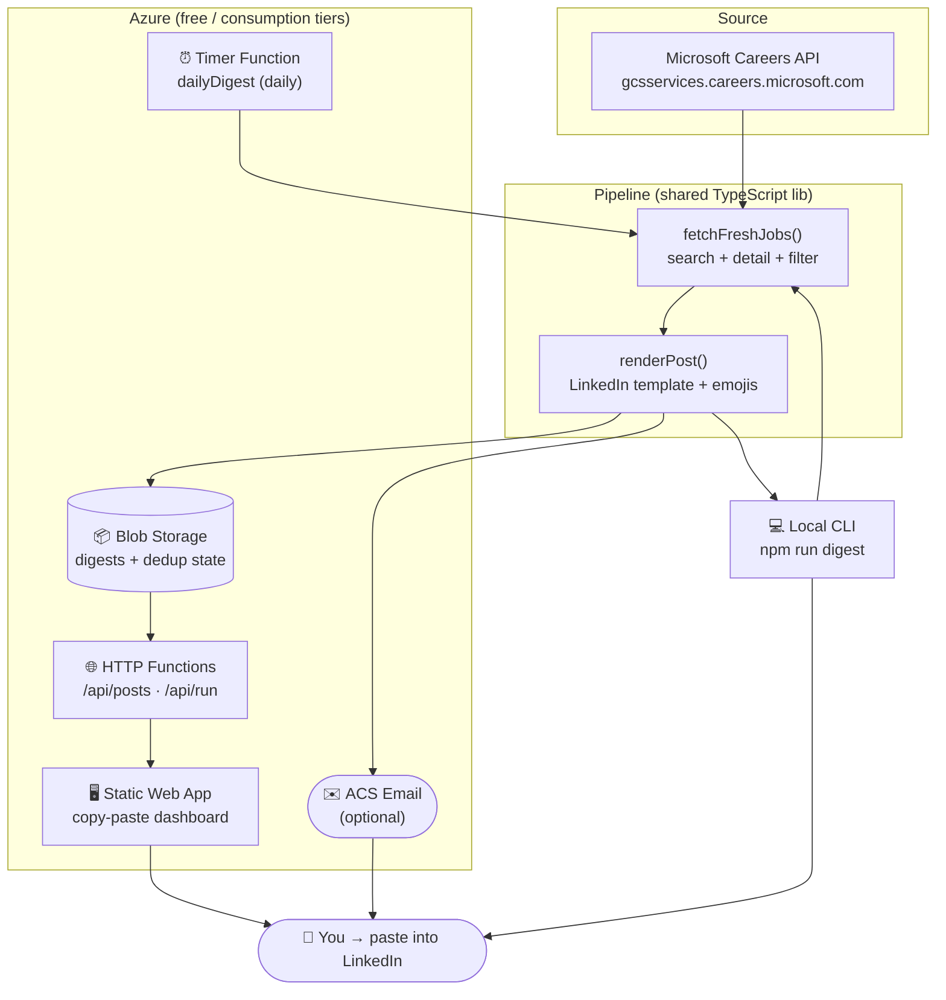

# msjobs2linkedin — Microsoft jobs → ready-to-paste LinkedIn posts

Every day, Microsoft posts hundreds of new roles on its careers site. This
pipeline pulls the **fresh** ones, formats each into a clean LinkedIn post
(title, location, level, pay, a short teaser, emojis, apply link, hashtags),
and hands you the text to **copy-paste** — you add the image and hit *Post*.

It runs two ways, and you can use either or both:

| Mode | What you get | Azure needed? |
| --- | --- | --- |
| **Local CLI** | Run one command, get today's posts in your terminal + a Markdown file | ❌ No |
| **Azure pipeline** | A timer runs every morning, saves the digest, and a web dashboard shows each post with a **Copy** button (optionally emails you) | ✅ Yes (free tiers) |

> **"Should I build it in Azure, or just get the content to copy-paste?"**
> Both are built here. Use the **CLI today** for instant copy-paste, and deploy the
> **Azure pipeline** so it happens automatically each morning without you running anything.

---

## Architecture



### How a run works
1. **Fetch** — query the Microsoft careers search API (newest-first, paginated),
   keep only jobs posted within the last *N* hours (default 24 = "today") that
   match your location/title filters.
2. **Enrich** — for each job, pull the detail endpoint to get a description
   teaser and, when the listing exposes it (US pay-transparency), the pay range.
3. **De-dup** — skip any job already included in a previous digest (state kept
   in Blob Storage).
4. **Render** — format each job into the LinkedIn template below.
5. **Deliver** — save to Blob (served to the dashboard), print to console + a
   Markdown file (CLI), and optionally email.

### The LinkedIn post template

```text
🚀 We're hiring at Microsoft!

💻 Senior Software Engineer
📍 Redmond, Washington, United States   🎯 Senior   🕐 Full-Time
🏠 Up to 50% work from home
💰 USD $137,600 - $272,800 per year
🗓️ Posted Jul 12, 2026

📝 Come build Azure! Design and ship services used by millions…

🔗 Apply here: https://jobs.careers.microsoft.com/global/en/job/1830000

#Microsoft #Hiring #TechJobs #NowHiring #Careers #JobSearch #SoftwareEngineering
```

---

## Repository layout

```
.
├── api/                       Azure Functions (TypeScript) + shared pipeline lib
│   ├── src/lib/               config (editions), source (pluggable), fetch,
│   │                          format, storage, email — the reusable core
│   ├── src/functions/         dailyDigest + dailyDigestIndia (timers),
│   │                          posts (HTTP), runNow (HTTP)
│   └── src/scripts/digest.ts  local CLI entry point (runs all editions)
├── web/                       self-contained static dashboard (no build step)
│   ├── index.html             cards with Copy buttons, reads /api/posts
│   └── staticwebapp.config.json
├── infra/
│   ├── main.bicep             all Azure resources (free/consumption)
│   └── deploy.sh              one-shot provision + publish
├── .env.example               every config option, documented
└── README.md
```

---

## Option A — Get today's posts right now (no Azure)

```bash
cd api
npm install
npm run digest
```

This runs **all editions** (US + India by default), prints each post in the
terminal, and writes a file per edition to `api/output/<date>-<edition>.md`.
Tune what you get with env vars (or a `.env` file in the repo root) — see
`.env.example`:

```bash
# just the US edition, wider window
MSJOBS_MAX_AGE_HOURS=48 MSJOBS_MAX_JOBS=10 npm run digest -- --edition=us

# India, senior roles only
MSJOBS_INDIA_TITLE_INCLUDES="Senior,Principal" npm run digest -- --edition=india
```

Useful flags: `--edition=<key>` (run one edition), `--dedup` (respect blob dedup
state), `--save` (persist to Azure if `AZURE_STORAGE_CONNECTION_STRING` is set),
`--email` (send via ACS).

---

## Option B — Deploy the automated Azure pipeline

**Prerequisites:** an Azure subscription, [Azure CLI](https://learn.microsoft.com/cli/azure/),
[Azure Functions Core Tools v4](https://learn.microsoft.com/azure/azure-functions/functions-run-local),
and the [SWA CLI](https://azure.github.io/static-web-apps-cli/) (`npm i -g @azure/static-web-apps-cli`).

```bash
az login
bash infra/deploy.sh          # provisions + publishes everything
```

The script prints your **dashboard URL** and **API base**. That's it — the
timer runs every morning (default 07:30, set `MSJOBS_SCHEDULE`), the dashboard
shows the latest posts with Copy buttons, and `/api/run` lets you refresh on
demand.

### What gets created (all free / consumption)
- **Storage account** — daily digests + dedup state (and the Functions runtime store)
- **Function App** (Linux, Node 20, Consumption Y1) — timer + HTTP endpoints
- **Application Insights** — logs/metrics
- **Static Web App** (Free) — the dashboard

### Manual deploy (if you prefer step-by-step)
```bash
az group create -n rg-msjobs -l eastus2
az deployment group create -g rg-msjobs -f infra/main.bicep -p namePrefix=msjobs
# then, using the output names:
cd api && npm ci && npm run build && func azure functionapp publish <functionAppName>
# deploy web/ to the Static Web App with its deployment token (see infra/deploy.sh)
```

### Endpoints
| Route | Method | Purpose |
| --- | --- | --- |
| `/api/posts` | GET | Latest saved digest (JSON) — the dashboard reads this. `?edition=us\|india` picks the edition; `?generate=1` builds one on first run. |
| `/api/run` | GET/POST | Run the pipeline on demand. `?edition=` picks the edition, `?all=1` ignores dedup. (function-key protected) |
| `dailyDigest` | timer | Scheduled daily US run. |
| `dailyDigestIndia` | timer | Scheduled daily India run (only when the India edition is enabled). |

---

## Editions (US + India)

The pipeline runs one or more **editions** — independent digests with their own
filters, schedule, storage, and dashboard tab. Two ship by default:

| Edition | Locations | Default schedule | Toggle |
| --- | --- | --- | --- |
| `us` | United States | 07:30 UTC | always on |
| `india` | India | 03:30 UTC (09:00 IST) | `MSJOBS_INDIA_ENABLED=false` to disable |

Each has its own timer function, its own `editions/<key>/…` blob subtree (so
de-dup never bleeds across editions), and its own dashboard dropdown entry
(`?edition=india`). Every `MSJOBS_*` knob has an `MSJOBS_INDIA_*` twin. Adding a
third edition (e.g. UK) is a few lines in `api/src/lib/config.ts` plus one timer.

## Job sources (pluggable)

Fetching sits behind a `JobSource` interface (`api/src/lib/source.ts`):

- **`api`** (default) — Microsoft's careers JSON API. This is the same endpoint
  the careers site itself calls and that virtually every "MS jobs scraper" uses
  under the hood. Fast, structured, and light enough for the free Consumption plan.
- **`playwright`** (stubbed) — a documented drop-in browser fallback for the day
  Microsoft locks the JSON endpoint down. It's intentionally **not** implemented
  or wired to a dependency, because a headless browser won't run on Consumption
  (you'd move to a Premium/container plan first). See
  `api/src/lib/playwrightSource.ts` for the exact activation steps.

Select per-edition with `MSJOBS_SOURCE` / `MSJOBS_INDIA_SOURCE`.

---

## Configuration reference

All settings are environment variables (Function App *Application Settings*, or
a local `.env`). Full list with defaults in [`.env.example`](./.env.example).

| Variable | Default | Meaning |
| --- | --- | --- |
| `MSJOBS_QUERY` | `Software Engineer` | Free-text careers search query |
| `MSJOBS_LOCATIONS` | `United States` | Comma-separated location filters |
| `MSJOBS_TITLE_INCLUDES` | *(none)* | Title must contain one of these |
| `MSJOBS_TITLE_EXCLUDES` | `Intern,Internship` | Exclude titles containing these |
| `MSJOBS_MAX_AGE_HOURS` | `24` | Only jobs posted within this window |
| `MSJOBS_MAX_JOBS` | `15` | Cap per digest |
| `MSJOBS_MAX_PAGES` | `4` | Search pages to scan (20/page) |
| `MSJOBS_SCHEDULE` | `0 30 7 * * *` | US timer (NCRONTAB) |
| `MSJOBS_SOURCE` | `api` | Fetch source: `api` or `playwright` |
| `MSJOBS_INDIA_ENABLED` | `true` | Enable the India edition |
| `MSJOBS_INDIA_*` | *(mirror of `MSJOBS_*`)* | India edition overrides (locations `India`, schedule `0 30 3 * * *`) |
| `AZURE_STORAGE_CONNECTION_STRING` | *(none)* | Enables blob output + dedup |
| `ACS_CONNECTION_STRING` / `ACS_SENDER_ADDRESS` / `MSJOBS_EMAIL_TO` | *(none)* | Optional email delivery |

---

## Notes & good citizenship
- Uses **public, unauthenticated** careers endpoints, lightly and once a day,
  with bounded concurrency. Posting is **manual** (you paste + add your image) —
  no automated LinkedIn posting, no ToS gray areas.
- Pay ranges only appear when the listing itself publishes one (mostly US roles).
- Microsoft may change its careers API; the fetch layer is isolated in
  `api/src/lib/msCareers.ts` so it's easy to adjust.
